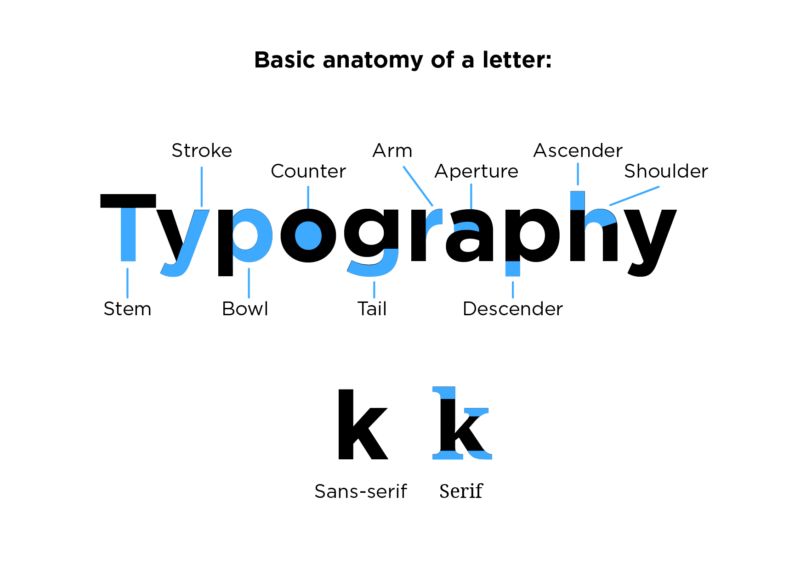
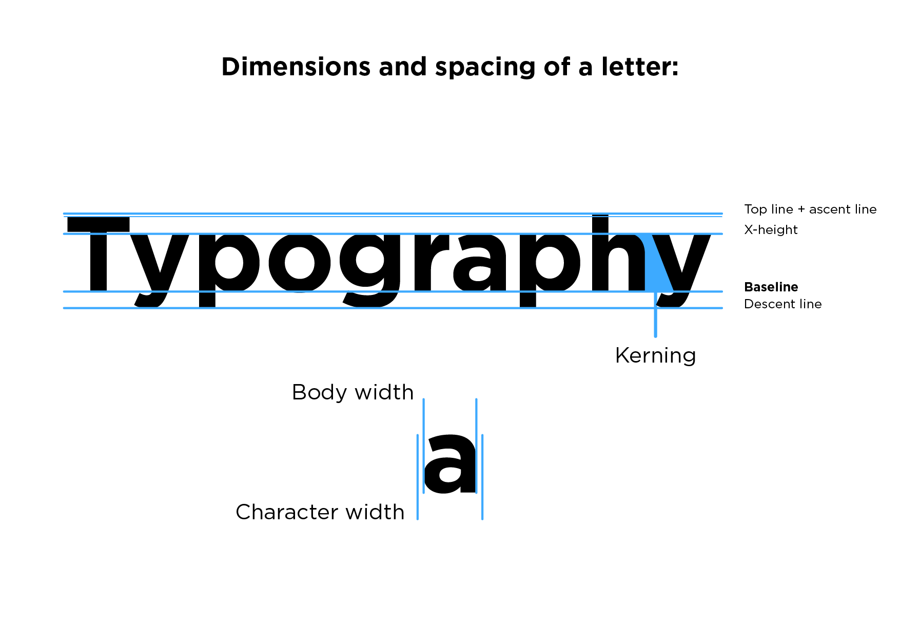
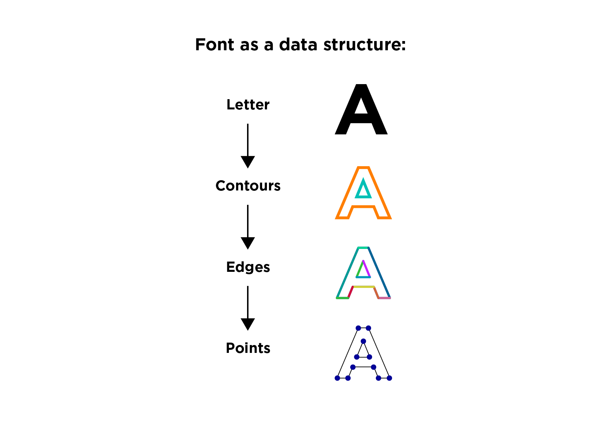

# Processing-Generative-Typography
Reference examples from Introduction to Generative Typography workshops held as a part of my Creative Coding classes. The workshops introduce students to already familiar topic of typography but in its generative form. There are two common usages of generative typography:
- **Generative typography for graphic design:** Used to create a parametric poster or generative branding elements. You can connect it with Arduino to generate something based on sensory input. Imagine an interactive poster which reacts to participant's heartbeat 
- **Generative typography for font creation:** It's possible to create a set of rules to have a consistent, parametric way to alter the font. You can save it as a font file to use outside of processing in any graphic design software. It's more feasible to manipulate existing font instead of building it from scratch. 

**There are also:**
- **Stable diffusion and other generative deep learning models:** For example check typographic effect in Adobe Firefly.
- **Variable fonts:** It is possible to create fonts with varying dimensions and weights. It's something different than we do in our classes. Fontastic library doesn't support variable fonts, there is software to do them.

### Requirements
- Processing
- Geomerative Library
- Fontastic Library
- ControlP5

Solid understanding of Processing's basics is enough to begin but there are some intermediate to advanced concepts depending on what you want to create. You should be familiar with arrays and object-oriented programming.

For the purpose of this class I'm using Free Sans. You can use any font you like.

### Using font generator:
*The second part of workshops shows how to create and save your own font. This is tricky to do on your own and there are a lot of possible improvements.*

**How to use it:**
1. Run the sketch.
2. Press any key to save as a font.
3. Inside processing sketch open data -> My custom font -> bin.
4. Inside that folder you can preview your font and install the *.ttf font.
5. The code sets the character width but you should use optical kerning to avoid headaches when manually setting the spacing.

### Anatomy of a letter:
There are approx. 35-40 unique characteristics. Below are some of them. Many people aren't aware how complex is Typography as a design discipline.
- You don't have to remember all of them but awareness is important for consistency.
- Same characteristics should be similar but applying same rules to everything usually creates very geometrical font, you can see that in best fonts not everything is equally same.
- The way how font looks can affect the overall meaning and mood of written message. 

  

### Dimensions and spacing of a letter:
Remember to set the correct spacing of letters. Lines should remain consistent across all letters. Spacing significantly affects the text readability.

  

### Font as a data structure
Each letter creates a tree-like data structure. Below are presented each depths of it. It's important to preserve steps while manipulating points to save as a new font. You can but you shouldn't go straight into points unless it's the only thing you want to use.

  
